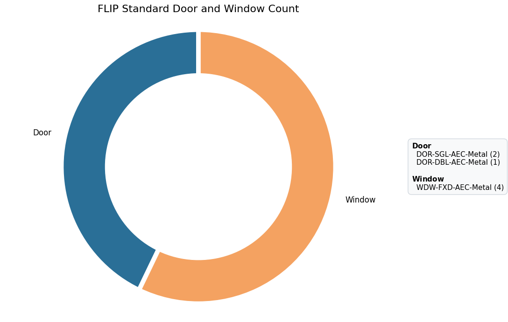
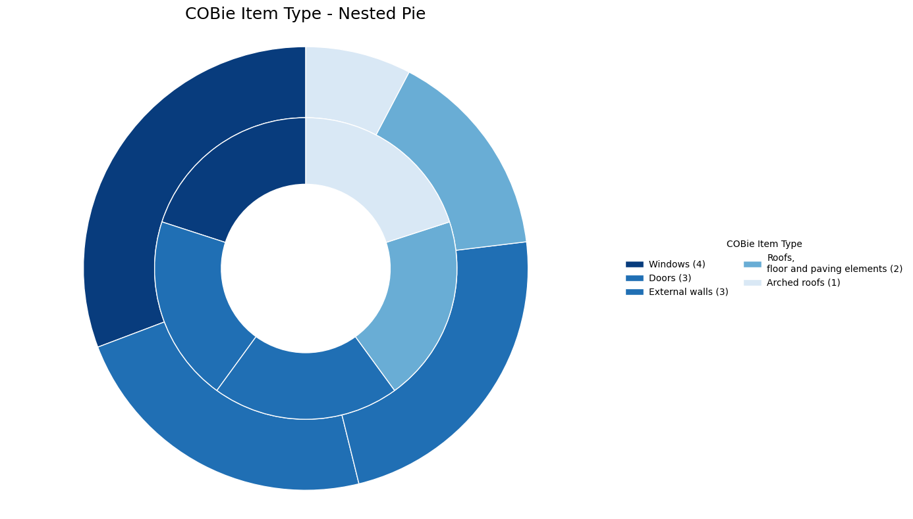
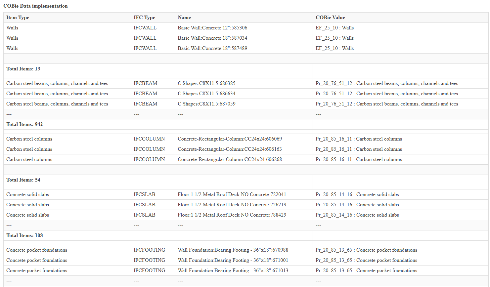
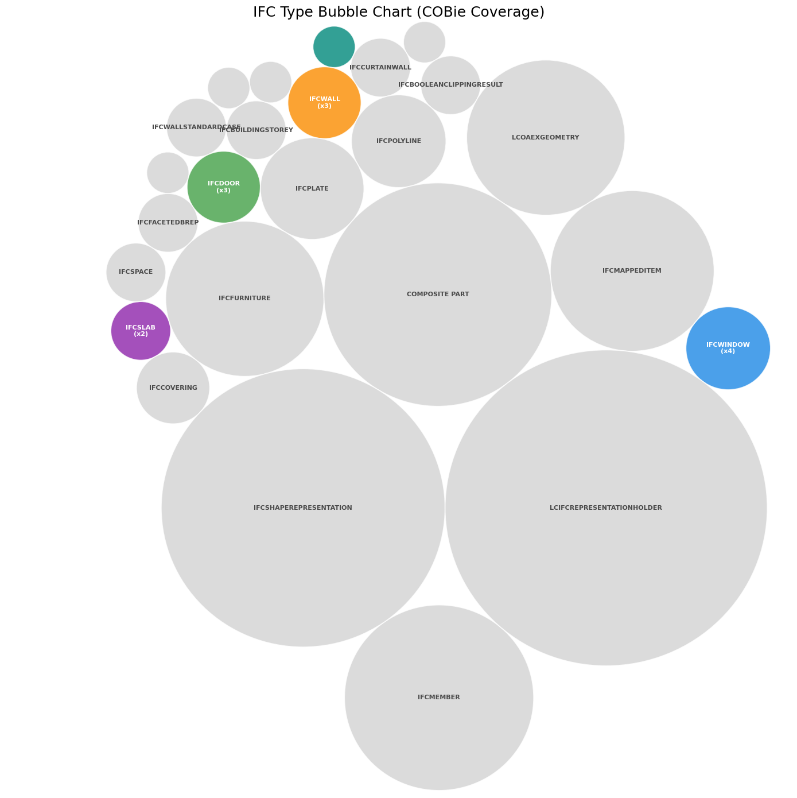
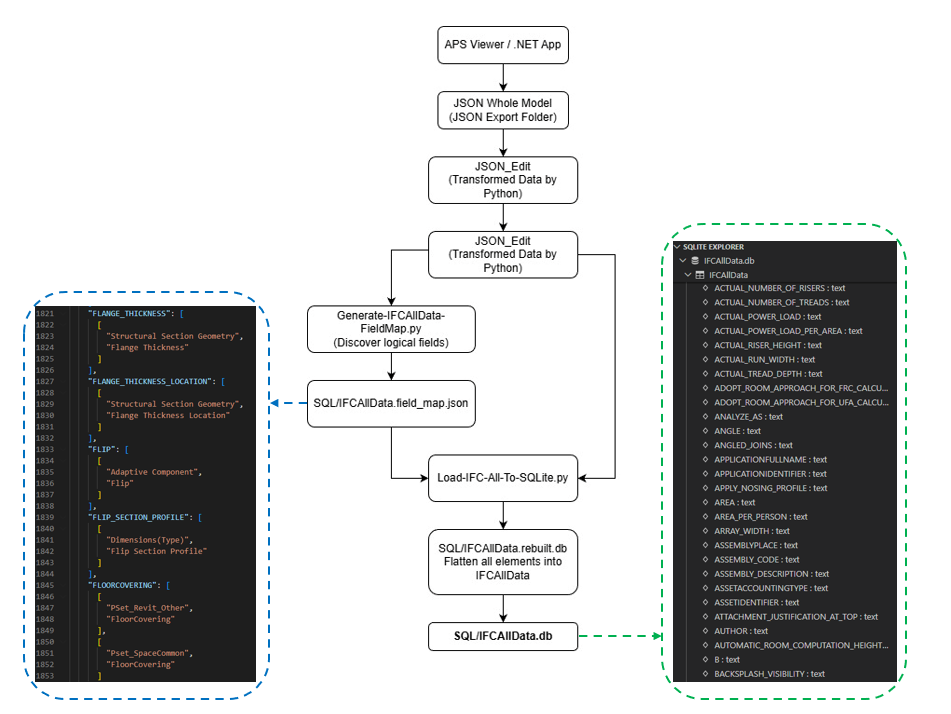
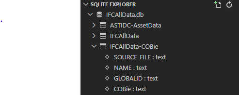
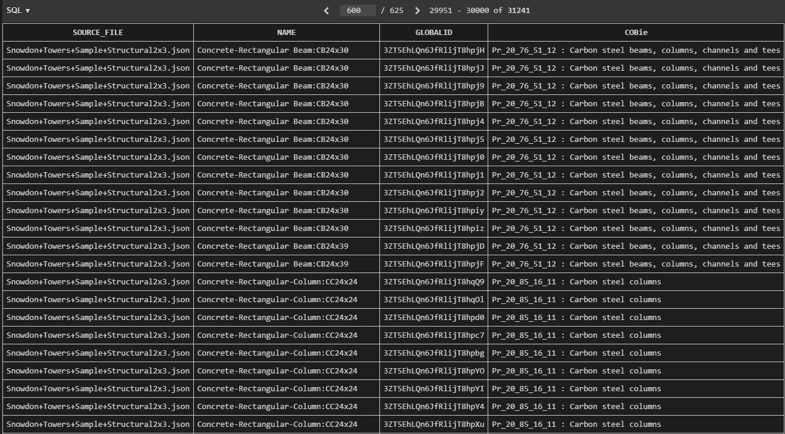
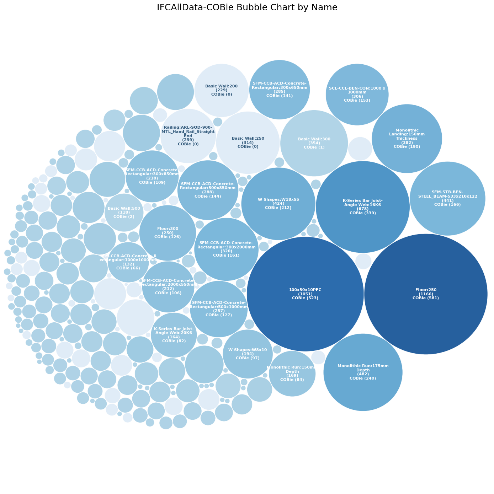
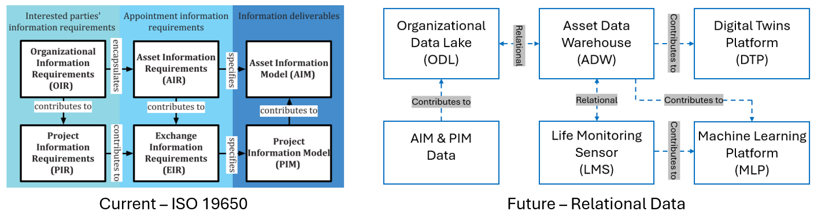

# MsC OpenBIM ETL Data Engineering Platform

This project explores a Data Engineering approach for OpenBIM workflows using Autodesk Platform Services [APS.NET](https://forge.autodesk.com) with [Simple Viewer](https://tutorials.autodesk.io/tutorials/simple-viewer/), [IFC](https://www.buildingsmart.org/about/openbim/), [JSON](https://www.json.org/json-en.html), [Python](https://www.python.org/) with [Jupyter Notebook](https://jupyter.org/), and [SQLite](https://sqlite.org/). The platform extracts BIM metadata from IFC models, transforms asset information into structured datasets, and demonstrates how BIM data can evolve from isolated model files into queryable data products suitable for Digital Twins, asset management, and future machine learning applications.

## 1. Overall Architecture

*Figure 1. OpenBIM ETL Overall Architecture for IFC metadata to individual Model to SQLite relational database.*

## 2. Features & Tech Stack
### Key Features

IFC metadata extraction using [APS.NET](https://forge.autodesk.com) & [IFCOpenShell](https://ifcopenshell.org/)
- OpenBIM JSON transformation workflow
- Python ETL pipeline for BIM asset data
- SQLite relational database integration
- COBie-aligned asset information structure
- Data querying for digital asset management
- Exploratory Data Analysis (EDA) for IFC metadata
- Foundation for Digital Twin and Machine Learning workflows

### Tech Stack
| Category | Technology |
|---|---|
| BIM Platform | [APS.NET](https://forge.autodesk.com) |
| BIM Format | [IFC](https://www.buildingsmart.org/about/openbim/) / [OpenBIM](https://www.buildingsmart.org/about/openbim/)|
| IFC Library | [IFCOpenShall](https://ifcopenshell.org/) |
| Backend | [C#.NET 8](https://dotnet.microsoft.com/en-us/download/dotnet/8.0)|
| Data Processing | [Python](https://www.python.org/) with [Jupyter Notebook](https://jupyter.org/) |
| Database | [SQLite](https://sqlite.org/) |
| Extracted Data Format | [JSON](https://www.json.org/json-en.html) |
| Version Control | [GitHub](https://github.com/plarchi/MsC-IFC-APS/tree/main) |
| Future Integration | [Power BI](https://app.powerbi.com/) / [Azure SQL, Blob and VM](https://azure.microsoft.com/en-us) |

## 3. Workflow Section
### 3.1 OpenBIM ETL Workflow

*Figure 2. OpenBIM ETL workflow for IFC metadata extraction, transformation, and validation.*

This workflow demonstrates how IFC metadata can be extracted from [APS.NET](https://forge.autodesk.com) into structured JSON datasets for further transformation using Python-based ETL processes.

The workflow includes:
- IFC model upload and visualization through APS
- Extraction of BIM metadata into JSON
- Python-based metadata transformation with correct Naming convention to IFC element Name
- COBie and naming convention enrichment
- Reloading transformed JSON data back into IFC models
- Visual verification of transformed IFC metadata

The objective is to transform OpenBIM data from isolated model files into reusable and queryable asset information structures.

## 3.2 Exploratory Data Analysis (EDA) Workflow

*Figure 3. Exploratory Data Analysis (EDA) workflow for IFC metadata transformation and standardization.*

Python and Jupyter Notebook were used to perform Exploratory Data Analysis (EDA) on extracted IFC JSON datasets.

The EDA workflow investigates:
- IFC entity classification
- Property set distribution
- Metadata consistency
- Object naming structure
- COBie mapping
- Category-based transformation logic

The workflow demonstrates how semi-structured IFC metadata can be analyzed, standardized, and prepared for future relational database and Digital Twin applications.

Processed datasets are exported as transformed JSON files for further validation and database integration.

## 4. Example Results for IFC Data
### IFC Metadata Transformation Result

*Figure 4. IFC metadata before and after ETL transformation workflow.*

The ETL workflow successfully transformed IFC metadata by applying:
- standardized naming conventions,
- COBie classification data,
- and structured object metadata enrichment.

The example above demonstrates the transformation of an IFC door element from its original BIM authoring format into a standardized OpenBIM asset structure.

### Before ETL
- Original object naming generated from BIM authoring software
- No structured COBie classification
- Limited asset information standardization

### After ETL
- Standardized object naming convention applied
- COBie classification successfully mapped into IFC metadata
- Enhanced interoperability and asset information consistency

This validation demonstrates how IFC metadata can be transformed through a Data Engineering workflow instead of relying solely on manual BIM model editing processes.

## 5. Data Visulisation and Verification
The transformed IFC metadata was further analysed and verified using Python-based data visualization workflows. These visualizations demonstrate the effectiveness of the ETL process and validate the successful implementation of standardized naming conventions and COBie asset information within IFC models.

---

### 5.1 IFC Naming Transformation Verification

The donut chart below illustrates the transformed IFC door and window naming conventions after the ETL workflow.

*Figure 5. Verification of transformed IFC door and window naming conventions.*

The result demonstrates:
- standardized IFC object naming,
- object classification consistency,
- and successful metadata transformation across multiple IFC elements.

---

### 5.2 COBie Data Coverage

The nested pie chart illustrates the distribution of COBie classifications applied to IFC elements.

*Figure 6. COBie classification distribution across IFC object categories.*

The ETL workflow successfully mapped COBie classifications into:
- IFCWINDOW
- IFCDOOR
- IFCWALL
- IFCSLAB
- and additional IFC asset categories.

---

### 5.3 COBie Data Implementation Table

The table below demonstrates examples of COBie data successfully loaded into IFC model elements.

*Figure 7. Example of COBie metadata implementation within IFC elements.*

The transformed IFC metadata includes:
- standardized classification codes,
- asset descriptions,
- IFC object types,
- and structured COBie references suitable for asset management workflows.

---

### 5.4 IFC Metadata Coverage Analysis

The bubble chart below visualizes IFC object categories containing COBie-related metadata after transformation.

*Figure 8. IFC object category coverage after COBie implementation.*

The analysis demonstrates that:
- only selected IFC object categories require COBie enrichment,
- while geometric and representation entities such as IFCPOLYLINE or IFCSHAPEREPRESENTATION do not require asset-level COBie metadata.

This validates the selective ETL strategy for efficient IFC metadata transformation and future relational database integration.

## 6. From JSON to SQLite

This stage extends the OpenBIM workflow from semi-structured IFC JSON extraction into a relational SQLite environment. The objective is not only to store IFC metadata, but also to establish an early-stage BIM Data Lake architecture capable of supporting scalable querying, asset analytics, COBie integration, and future Digital Twin development.

Rather than treating IFC models as isolated files, this workflow demonstrates how multiple IFC datasets can be consolidated into a centralized relational data environment. The process aligns with modern Data Engineering concepts where raw IFC-derived JSON datasets operate as a BIM-oriented Data Lake, while selective structured queries can later evolve into targeted Data Warehouse solutions for asset management and operational analytics.

---

### 6.1 Multiple IFC JSON Models as a BIM Data Lake

The workflow below illustrates the transformation process from multiple IFC-derived JSON datasets into a centralized SQLite relational database.

*Figure 9. Workflow from multiple IFC JSON datasets into SQLite relational databases.*

The process begins with IFC metadata extraction through APS Viewer and .NET applications. The exported JSON datasets are then transformed and normalized using Python scripts before being mapped into logical relational fields. A dynamic field mapping process was developed to automatically discover IFC properties and flatten semi-structured metadata into structured relational tables.

This approach enables multiple IFC model datasets to be consolidated into a single SQLite environment, effectively creating a lightweight BIM Data Lake. The SQLite database stores both raw and transformed IFC metadata, allowing large volumes of IFC information to remain queryable outside traditional BIM authoring software.

The workflow also demonstrates an important transition from file-centric BIM workflows toward data-centric BIM infrastructure, where IFC metadata becomes reusable enterprise data rather than isolated project deliverables.

---

### 6.2 Relational Querying from the BIM Data Lake

Once multiple IFC datasets were consolidated into SQLite, relational queries could be performed directly across the centralized BIM Data Lake.

*Figure 10. Querying IFC relational data within SQLite.*

The database structure enables:
- querying IFC elements across multiple source models,
- filtering metadata by IFC properties and classifications,
- tracing elements using GlobalID,
- and analysing asset information independently from BIM authoring tools.

The successful flattening of IFC metadata into relational tables demonstrates how OpenBIM data can support scalable querying and cross-model analysis. Instead of manually reviewing IFC files individually, users can retrieve asset information through structured SQL queries.

This relational structure also provides a foundation for future interoperability between BIM, asset management systems, and enterprise analytics platforms.

---

### 6.3 Selective Asset Querying as a BIM Data Warehouse

A separate SQLite structure was created for selective asset-focused querying using filtered IFC property extraction.

*Figure 11. Selective IFC asset querying within SQLite.*

Unlike the broader BIM Data Lake approach, this stage focuses on extracting targeted asset information for operational use cases. Only selected IFC properties relevant to asset management and COBie workflows were loaded into simplified relational tables.

This structure represents an early-stage BIM Data Warehouse concept, where curated and structured IFC metadata can support:
- asset management workflows,
- lifecycle information tracking,
- COBie deliverables,
- operational reporting,
- and future Digital Twin analytics.

The separation between raw IFC metadata and curated asset datasets reflects common enterprise Data Engineering practices, where Data Lakes retain large-scale raw information while Data Warehouses provide optimized datasets for business and operational analysis.

---

### 6.4 COBie Relational Analysis Across Multiple IFC Models

The relational SQLite database was further analysed using Python visualization workflows to validate COBie integration across multiple IFC datasets.

*Figure 12. COBie analysis from relational SQLite database queries.*

The bubble chart visualization demonstrates the successful querying and aggregation of COBie-enriched IFC metadata from multiple models. The analysis highlights:
- relational grouping of IFC object types,
- comparison of COBie classifications,
- scalable metadata aggregation across datasets,
- and the ability to identify asset-rich model categories.

This stage demonstrates how OpenBIM workflows can move beyond geometry-centric BIM usage into data-driven analytical environments. By combining IFC metadata, relational databases, and Python analytics, the workflow establishes a scalable foundation for future BIM Data Lakes, Data Warehouses, Digital Twins, and machine learning applications.

---

## 7. Future Development

*Figure 13. Future development from ISO 19650 information requirements toward relational BIM Data Lake and Digital Twin platforms.*

The future development of this research extends beyond IFC model transformation into a scalable relational data ecosystem for Digital Twins and intelligent asset management.

Based on the ISO 19650 information hierarchy, this research proposes a future workflow where:
- Multiple IFC AIM and PIM datasets can form an Organizational Data Lake (ODL)
- Relational SQLite or cloud databases can evolve into an Asset Data Warehouse (ADW)
- Curated asset information can support operational analytics and lifecycle management
- Live sensor and monitoring data can integrate with BIM asset information
- Digital Twin Platforms (DTP) can be developed using centralized relational BIM data
- Machine Learning Platforms (MLP) may use historical BIM and sensor datasets for predictive analysis

This research demonstrates an early-stage proof-of-concept for transforming OpenBIM workflows from isolated model files into enterprise-level relational data infrastructure.

The long-term vision is to shift BIM from geometry-centric workflows toward scalable data-centric platforms capable of supporting:
- smart asset management,
- operational intelligence,
- predictive maintenance,
- and future AI-assisted Digital Twin applications.

The proposed framework also creates future opportunities for integration with:
- Azure SQL and cloud storage,
- Power BI dashboards,
- real-time IoT sensor systems,
- and city-scale Digital Twin environments.

## 8. Key Review from Python Notebook

The following notebooks and scripts demonstrate the core Data Engineering workflows developed throughout this research project, including IFC metadata analysis, ETL transformation, relational database generation, and COBie asset querying.

### 8.1 IFC Metadata Analysis Example
Python notebook for Exploratory Data Analysis (EDA) of IFC JSON datasets, including category distribution, metadata validation, and IFC property investigation.

🔗 [IFC Metadata Analysis Notebook](https://github.com/plarchi/MsC-IFC-APS/blob/main/PyDataAnalysis/ACD-18040-ALL-ST-N2x3.ipynb)

---

### 8.2 IFC JSON Transformation Example
Python notebook demonstrating ETL transformation workflows for IFC metadata, including naming convention standardization and COBie enrichment.

🔗 [IFC JSON Transformation Notebook](https://github.com/plarchi/MsC-IFC-APS/blob/main/PyDataTransform/ACD-18040-ALL-ST-N2x3.ipynb)

---

### 8.3 Dynamic IFC Field Mapping for SQLite
Python script for generating dynamic field mappings from multiple IFC JSON datasets into relational SQLite structures.

🔗 [Generate IFC Field Mapping Script](https://github.com/plarchi/MsC-IFC-APS/blob/main/PyToSQL/Generate-IFCAllData-FieldMap.py)

---

### 8.4 COBie Asset Data Warehouse Query
SQL workflow demonstrating selective IFC asset querying and COBie-based Data Warehouse generation from centralized SQLite databases.

🔗 [COBie SQLite Query Workflow](https://github.com/plarchi/MsC-IFC-APS/blob/main/SQL/IFCAllData-COBie.sql)

---

These notebooks and scripts represent the practical implementation of the OpenBIM ETL workflow and demonstrate how IFC metadata can be transformed into scalable relational data structures for Digital Twin and future Data Engineering applications.

## License

This sample is licensed under the terms of the [MIT License](http://opensource.org/licenses/MIT).
Please see the [LICENSE](LICENSE) file for more details.
=======
