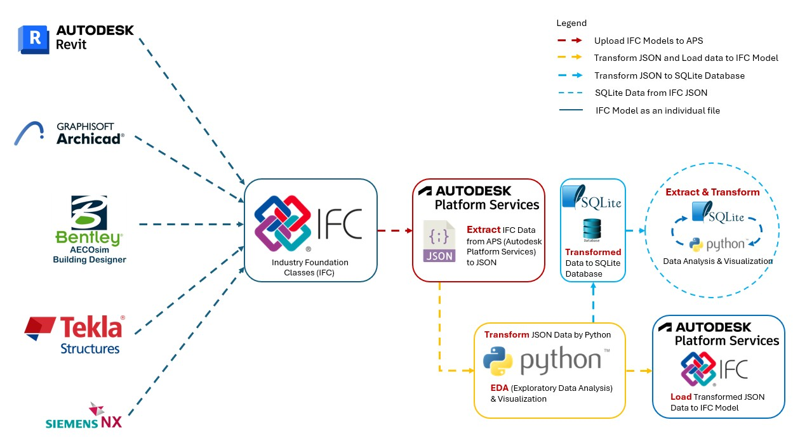
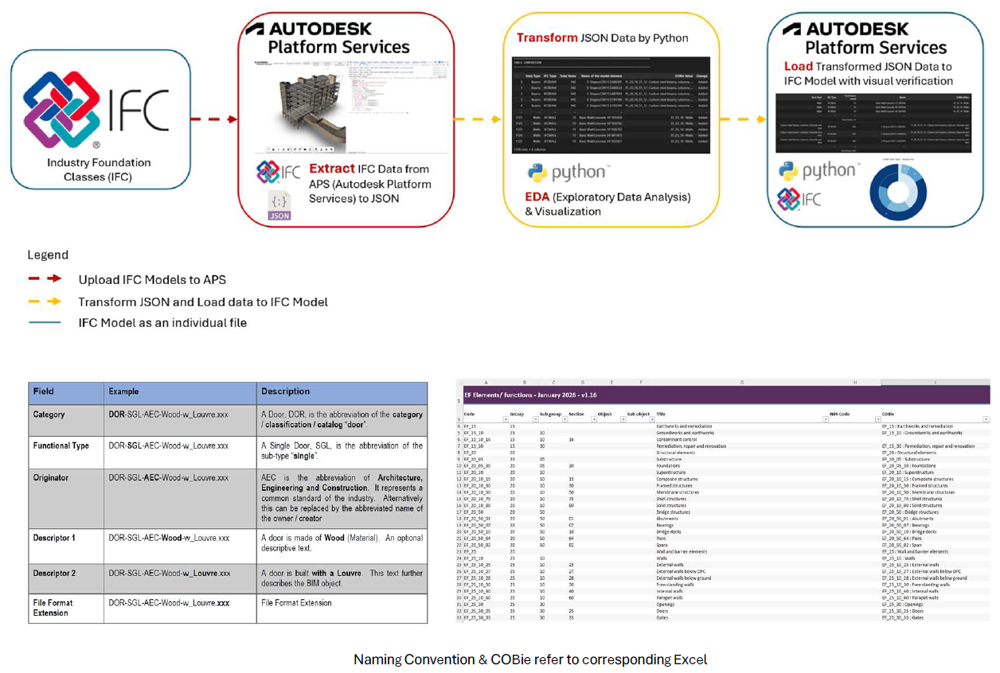
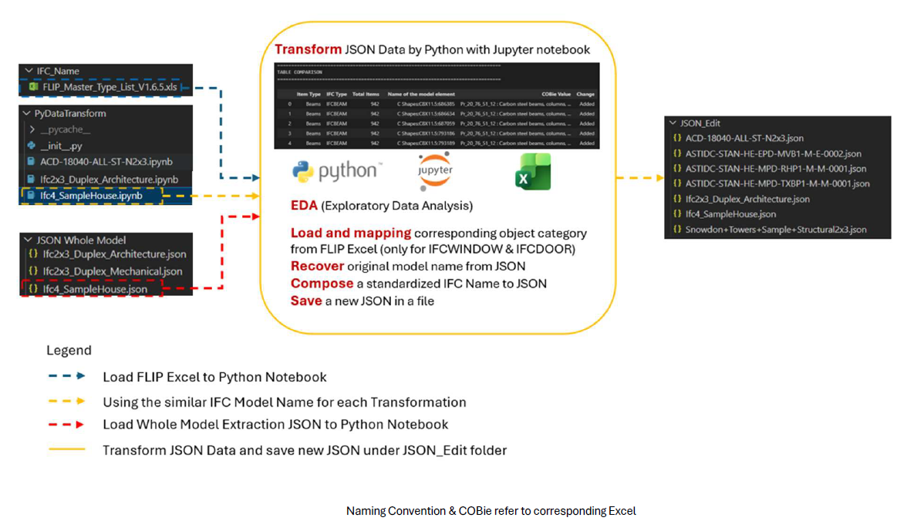
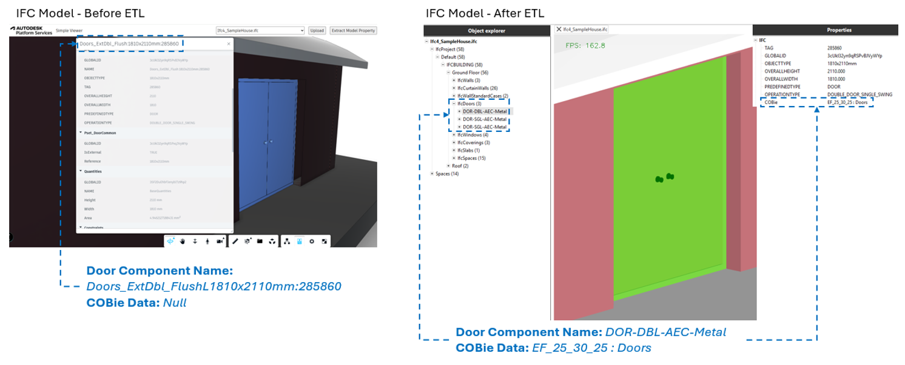

# MsC OpenBIM ETL Data Engineering Platform


[](https://dotnet.microsoft.com/en-us/download/dotnet/6.0)
[](https://opensource.org/licenses/MIT)

This project explores a Data Engineering approach for OpenBIM workflows using Autodesk Platform Services [APS.NET](https://forge.autodesk.com) with [Simple Viewer](https://tutorials.autodesk.io/tutorials/simple-viewer/), [IFC](https://www.buildingsmart.org/about/openbim/), [JSON](https://www.json.org/json-en.html), [Python](https://www.python.org/) with [Jupyter Notebook](https://jupyter.org/), and [SQLite](https://sqlite.org/). The platform extracts BIM metadata from IFC models, transforms asset information into structured datasets, and demonstrates how BIM data can evolve from isolated model files into queryable data products suitable for Digital Twins, asset management, and future machine learning applications.

## 1. Overall Architecture


*Figure 1. OpenBIM ETL Overall Architecture for IFC metadata to individual Model to SQLite relational database.*

## 2. Features & Tech Stack
### Key Features

IFC metadata extraction using [APS.NET](https://forge.autodesk.com) & [IFCOpenShell](https://ifcopenshell.org/)
- OpenBIM JSON transformation workflow
- Python ETL pipeline for BIM asset data
- SQLite relational database integration
- COBie-aligned asset information structure
- Data querying for digital asset management
- Exploratory Data Analysis (EDA) for IFC metadata
- Foundation for Digital Twin and Machine Learning workflows

### Tech Stack
| Category | Technology |
|---|---|
| BIM Platform | [APS.NET](https://forge.autodesk.com) |
| BIM Format | [IFC](https://www.buildingsmart.org/about/openbim/) / [OpenBIM](https://www.buildingsmart.org/about/openbim/)|
| IFC Library | [IFCOpenShall](https://ifcopenshell.org/) |
| Backend | [C#.NET 8](https://dotnet.microsoft.com/en-us/download/dotnet/8.0)|
| Data Processing | [Python](https://www.python.org/) with [Jupyter Notebook](https://jupyter.org/) |
| Database | [SQLite](https://sqlite.org/) |
| Extracted Data Format | [JSON](https://www.json.org/json-en.html) |
| Version Control | [GitHub](https://github.com/plarchi/MsC-IFC-APS/tree/main) |
| Future Integration | [Power BI](https://app.powerbi.com/) / [Azure SQL, Blob and VM](https://azure.microsoft.com/en-us) |

## 3. Workflow Section
### 3.1 OpenBIM ETL Workflow

*Figure 2. OpenBIM ETL workflow for IFC metadata extraction, transformation, and validation.*

This workflow demonstrates how IFC metadata can be extracted from [APS.NET](https://forge.autodesk.com) into structured JSON datasets for further transformation using Python-based ETL processes.

The workflow includes:
- IFC model upload and visualization through APS
- Extraction of BIM metadata into JSON
- Python-based metadata transformation with correct Naming convention to IFC element Name
- COBie and naming convention enrichment
- Reloading transformed JSON data back into IFC models
- Visual verification of transformed IFC metadata

The objective is to transform OpenBIM data from isolated model files into reusable and queryable asset information structures.

## 3.2 Exploratory Data Analysis (EDA) Workflow


*Figure 3. Exploratory Data Analysis (EDA) workflow for IFC metadata transformation and standardization.*

Python and Jupyter Notebook were used to perform Exploratory Data Analysis (EDA) on extracted IFC JSON datasets.

The EDA workflow investigates:
- IFC entity classification
- Property set distribution
- Metadata consistency
- Object naming structure
- COBie mapping
- Category-based transformation logic

The workflow demonstrates how semi-structured IFC metadata can be analyzed, standardized, and prepared for future relational database and Digital Twin applications.

Processed datasets are exported as transformed JSON files for further validation and database integration.

## 4. Example Results for IFC Data
### IFC Metadata Transformation Result


*Figure 4. IFC metadata before and after ETL transformation workflow.*

The ETL workflow successfully transformed IFC metadata by applying:
- standardized naming conventions,
- COBie classification data,
- and structured object metadata enrichment.

The example above demonstrates the transformation of an IFC door element from its original BIM authoring format into a standardized OpenBIM asset structure.

### Before ETL
- Original object naming generated from BIM authoring software
- No structured COBie classification
- Limited asset information standardization

### After ETL
- Standardized object naming convention applied
- COBie classification successfully mapped into IFC metadata
- Enhanced interoperability and asset information consistency

This validation demonstrates how IFC metadata can be transformed through a Data Engineering workflow instead of relying solely on manual BIM model editing processes.

## 5. From JSON to SQLite
## 6. Research Value
## 7. Future Development
## 8. Installation


- Clone this repository: `git clone https://github.com/autodesk-platform-services/aps-simple-viewer-dotnet`
- Go to the project folder: `cd aps-simple-viewer-dotnet`
- Install .NET dependencies: `dotnet restore`
- Open the project folder in a code editor of your choice
- Create an _appsettings.Development.json_ file in the project folder (if it does not exist already),
and populate it with the JSON snippet below, replacing `<client-id>` and `<client-secret>`
with your APS Client ID and Client Secret:

```json
{
  "Logging": {
    "LogLevel": {
      "Default": "Information",
      "Microsoft.AspNetCore": "Warning"
    }
  },
  "APS_CLIENT_ID": "<client-id>",
  "APS_CLIENT_SECRET": "<client-secret>"
}
```

- Run the application, either from your code editor, or by running `dotnet run` in terminal
- Open http://localhost:8080

> When using [Visual Studio Code](https://code.visualstudio.com), you can run & debug
> the application by pressing `F5`.

## License

This sample is licensed under the terms of the [MIT License](http://opensource.org/licenses/MIT).
Please see the [LICENSE](LICENSE) file for more details.
=======
